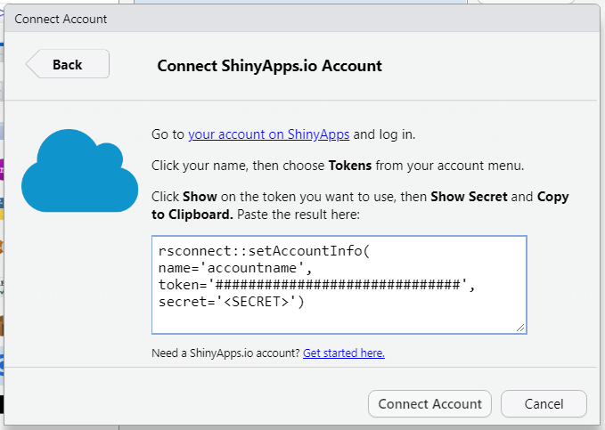
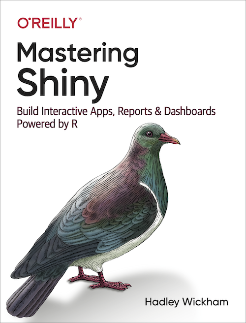
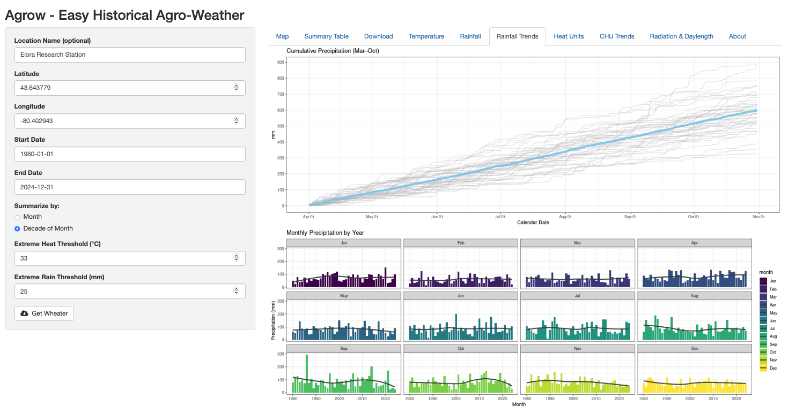
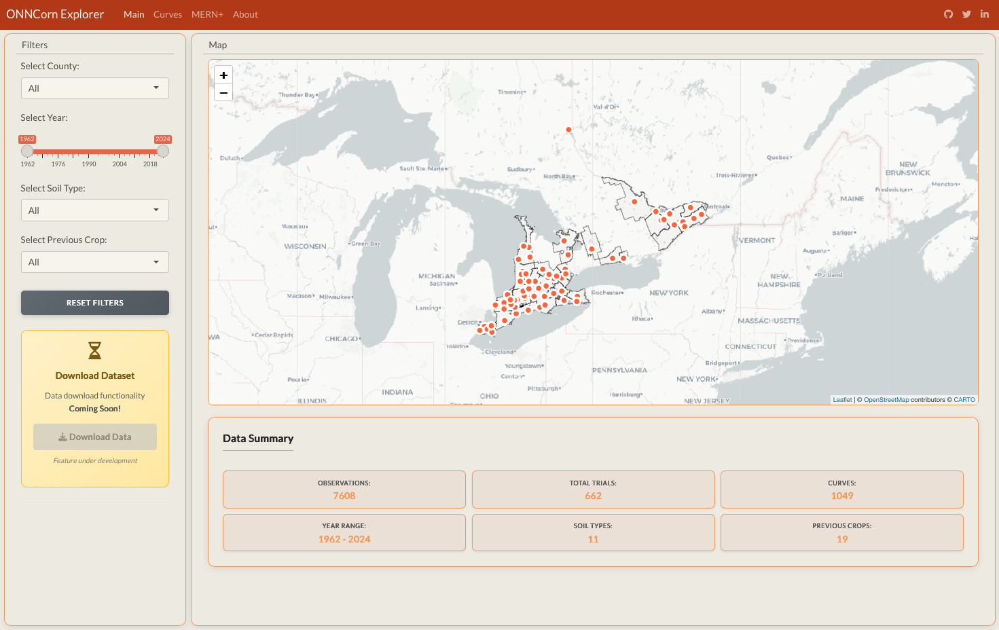
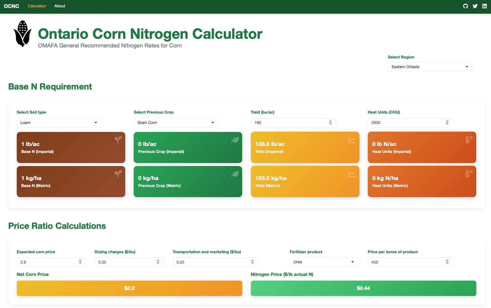
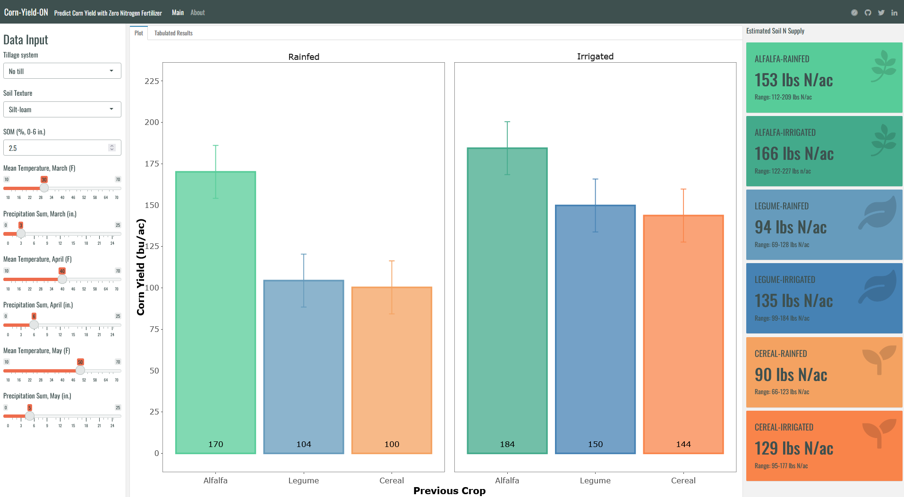
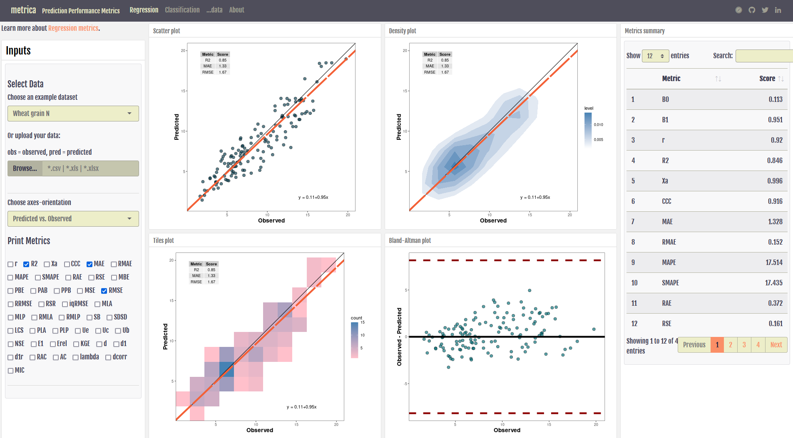
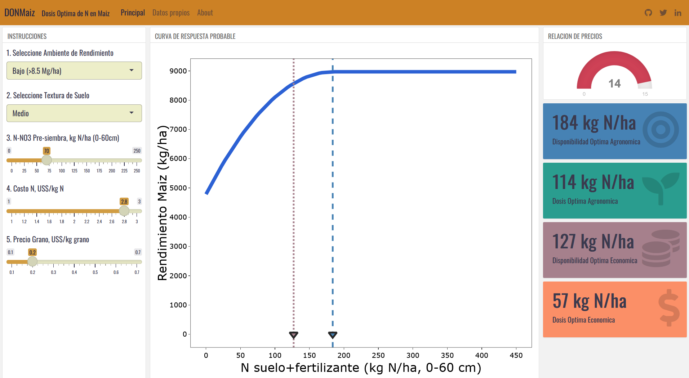
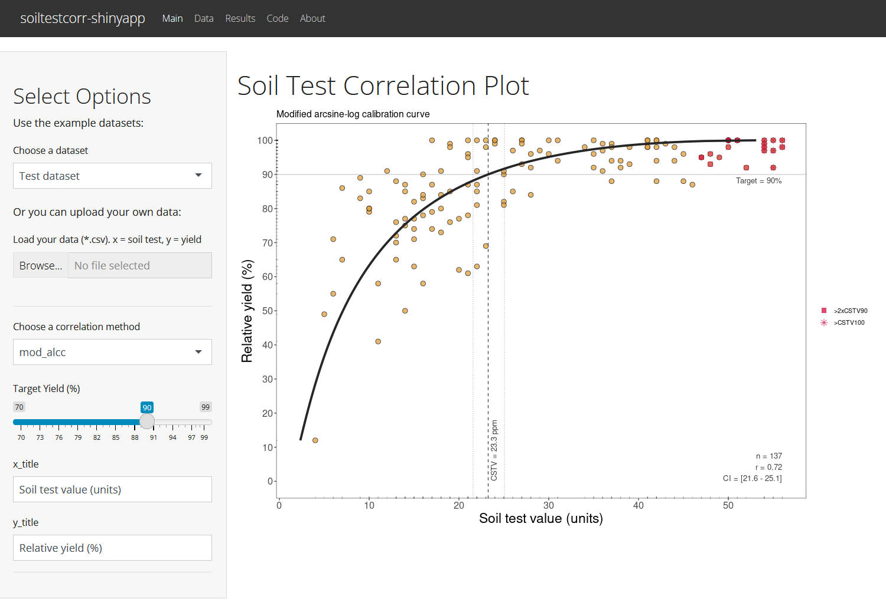
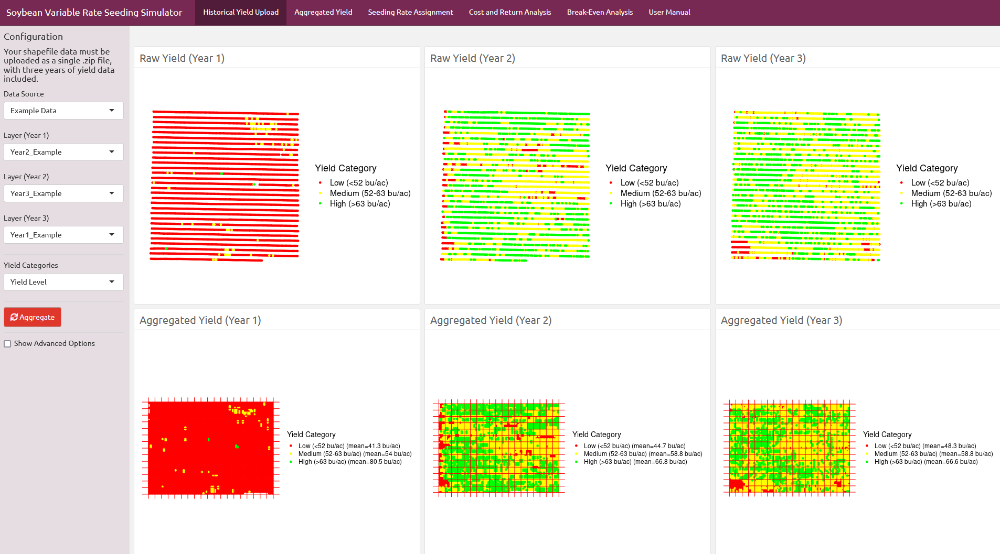

## Shiny apps 🌟

This note shares practical options to create Shiny apps in R, with an emphasis on choices that work well for students and reproducible workflows.

::: callout-note
**Shiny** consists of a packages family that facilitates the creation of interactive web tools 💻 using R! (and recently Python too)
:::

::: callout-important
**Why is Shiny relevant to us?**

In simple words, it can make us better data scientists by:

-   Adding value to our research, increasing the accessibility and visibility. A published paper is great but no the end of the story.

-   Allowing stakeholders to explore our results in a flexible platform at their own pace.

-   Offering interactive recommendation guidelines.

    -   See [cornyield0N](https://ciampittilab.shinyapps.io/cornyield0N/), [DONMaiz](https://ciampittilab.shinyapps.io/DONMaiz/), [SoybeanVRS](https://analytics.iasoybeans.com/cool-apps/SoybeanVRSsimulator/)

-   Facilitating the use of software development by peers (e.g. demo of R packages)

    -   See [soiltestcorr](https://ciampittilab.shinyapps.io/soiltestcorr/), [metrica](https://ciampittilab.shinyapps.io/metrica/)
:::

## 1. Main features

Shiny has many features that make it unique. My top list is the following:

1.  The main secret of shiny is the [*reactive programming*](https://en.wikipedia.org/wiki/Reactive_programming). This is what if makes it easy to transform R code into an interactive platform that offers "*outputs*" that react to users' "*inputs*".

2.  A second great feature is a default design of the user interface (⚠️*spoiler alert!*) based on [Bootstrap](https://getbootstrap.com/), which is the reason why we don't directly need to apply HTML, CSS or Java language by ourselves, this tool does it for us.

    {width="42" height="35"}

3.  The next special feature of shiny is a pre-built collection of [widgets](https://shiny.rstudio.com/gallery/widget-gallery.html) that make the app attractive and intuitive (e.g. sliders, check boxes, value boxes, gauges, etc.)

4.  Then, probably the most important for us (no web developers), is its integration with [RMarkdown](https://shiny.rstudio.com/articles/interactive-docs.html) (& [Quarto](https://quarto.org/docs/gallery/#interactive-docs)) through [Flexdashboard](https://rstudio.github.io/flexdashboard/).

5.  Of course, as you get more proficient, you will find there are many more features to squeeze...for more information visit <https://rstudio.github.io/shiny/>

## 2. Development options

::: callout-important
Today we are going to (briefly) cover the three main development options:

\(i\) [Base Shiny](https://rstudio.github.io/shiny/)

\(ii\) [Flexdashboard](https://rstudio.github.io/flexdashboard/)

\(iii\) [Quarto](https://quarto.org/docs/gallery/)

\(iv\) [UI Editor](https://rstudio.github.io/shinyuieditor/index.html)
:::

### (i) Base Shiny

{width="73"}

Base shiny is undoubtedly the most powerful option. However, I personally feel this as the most challenging one in terms of syntax, which is definitely its bottleneck for adoption.

Structure.

Base shiny apps are segregated into two main components:

-   **User Interface** (UI)

    -   it controls what and how is being displayed on the application page.

    -   it receives the users' input to start with the reactive programming.

    -   thus, it includes the text, widgets, plots, etc...

-   **Server**

    -   it controls the data that is used to produce the outcomes displayed on the UI.

    -   it normally contains the code to load the libraries, wrangle the data, and define plot functions.

    -   it borrows input values defined by the UI

Both UI and server could be either included into a single file (App.R) or they can be separated into two files to simplify future changes.

Let's see this with one example

::: callout-tip
-   Create a new project (and directory) along with a script file named "`app.R"` file containing a basic app.

    -   Go to **File \> New Project \>** **New Directory \> Shiny Web Application.**

    -   File \> New File \> R Script, or use the shortcut "Ctrl + Shift + N"

    -   Then add the following lines
:::

```{r}
# library(shiny)
# ui <- fluidPage(
#   "Hello, world! We are Statasaurus!"
# )
# server <- function(input, output) {
# }
# shinyApp(ui, server)
```

### Example with base Shiny

SHINYAPP: <https://ciampittilab.shinyapps.io/soiltestcorr/>

CODE: <https://github.com/adriancorrendo/Shiny_soiltestcorr>

### (ii) Flexdashboard

{width="73"}

Flexdashboard is a package developed by RStudio that allows to publish interactive dashboards using R Markdown (& Quarto) syntax.

The main features that I personally highlight are:

-   **Layout**: the easiness to specify the app skeleton using row/column based layouts.

-   **Report format**: the Rmarkdown format allows the keep a similar format used for our data processing and analysis, so we don't need to drastically change our usual syntax.

-   **Webpage**: we can develop not only the shiny apps but also webpages, blogs with the shiny apps embedded on them.

-   **Formatting**: As well as base shiny, flexdashboard can optionally apply Bootstrap and [bslib](https://rstudio.github.io/bslib/) to customize colors, fonts, and more.

-   **Display code in place**: for teaching, the RMarkdown syntax using chunks allows us to eventually display the code within the same location on the UI.

-   **UI-Server**: There is no need of segregating our code into UI and Server anymore.

::: callout-warning
Advanced users consider that flexdashboard is limited in comparison to what one can do with base shiny (Shiny & Shinydashboard packages).
:::

```{r}
# install.packages("flexdashboard")

```

### Example with Flexdashboard

Let's see now the metrica app code using Flexdashboard

SHINYAPP: <https://ciampittilab.shinyapps.io/metrica/>

CODE: <https://github.com/adriancorrendo/flexdashboard_metrica>

### (iii) Quarto option (interactive documents) 📄⚡

Quarto can be used to create **interactive documents** that feel like a report, but include Shiny-style inputs and reactive outputs. This is a great option when your goal is to communicate an analysis *with narrative* (methods + results + interpretation) while still allowing the reader to explore scenarios.

**When this option is a good fit** - You want a “report-first” workflow (text + code + outputs) with a small amount of interactivity. - Your app is mostly a single page (or a few pages) and does not require complex navigation. - You want something that is easier to keep reproducible, because the analysis and communication live in the same `.qmd` file.

**Typical examples** - Interactive EDA report: choose a variable, choose a site/year, and update a plot + summary table. - Recommendation demo: change a few assumptions and show how outputs change. - Teaching: demonstrate data wrangling or model behavior interactively.

#### Quarto interactive document (Shiny runtime)

Create a file like `interactive_report.qmd`:

``` yaml
---
title: "Interactive report (Quarto + Shiny)"
format: html
runtime: shiny
---
```

#### Pros / cons (practical)

**Pros** - Very reproducible: narrative + code + outputs in one place. - Low friction for students already writing Quarto. - Great for “interactive report” deliverables.

**Cons** - For large apps (many tabs/pages, complex logic), base Shiny is usually better. - Navigation is possible (Quarto websites), but the reactive logic can get harder to manage as projects grow.

::: callout-tip
Rule of thumb: - If you want an *interactive report*, Quarto + Shiny runtime is an excellent option. - If you want a full *web application*, base Shiny (or a dashboard framework) will scale better.
:::

#### Deployment note 🚀

Quarto interactive documents can be shared similarly to apps: - locally (students can run/render the document), - or hosted using the same infrastructure used for Shiny apps (depending on what your institution supports).

If hosting is not available for the course, students can still submit: - the `.qmd` file, - a rendered HTML (if allowed), - and a short README explaining how to run it.

### (iv) UI Editor

The [UI Editor](https://rstudio.github.io/shinyuieditor/index.html) is a tool currently under development intended to remove barriers on the use of base shiny by non-webpage developers.

```{r eval=FALSE}
# install.packages("remotes")

# Install using the remotes package
# remotes::install_github("rstudio/shinyuieditor")
```

It basically speeds up to process of creating the layout of the UI using an interactive interface. It would be a kind of Shiny App for creating Shiny Apps.

-   **Code template**: the UI Editor will create the necessary code in Base Shiny syntax for us (App.R). Later we would just need to fine tune formatting, fonts, colors, etc. This feature is a claear advantage for cases when we would need advanced features into the layout where Flexdashboard could be limited.

Keep tabs on this cause more resources on the UI Editor are coming soon

::: {align="center"}
<iframe width="560" height="315" src="https://www.youtube.com/embed/Zac1qdaYNsY" frameborder="0" allowfullscreen>

</iframe>
:::

## 3. Deploying the Shiny App

Believe it or not, publishing our Shiny app is quite easy! (with limitations)

We just need to:

1.  [Create an account](https://www.shinyapps.io/admin/#/signup) on shinyapps.io (for free!).

2.  Install the *rsconnect* package in our session.

```{r eval=FALSE}

# install.packages("rsconnect")

```

3.  Account authorization: go to your shinyapps account and copy the TOKEN (showing the *secret*) provided in your dashboard and run it in your RStudio console at **Tools \> Global Options \> Publishing \> Connect ... \> ShinyApps.io**.

    

4.  Click on the 'Publish' button at the top right corner.

5.  Done!

## 4. Resources

1.  Mastering Shiny Book: <https://mastering-shiny.org/>

{width="131"}

3.  Official User Guide: <https://docs.rstudio.com/shinyapps.io/>
4.  Shiny Tutorial: <https://shiny.rstudio.com/tutorial/>
5.  Shiny Gallery: <https://shiny.rstudio.com/gallery/#demos>
6.  Flexdashboard Shiny Gallery: <https://pkgs.rstudio.com/flexdashboard/articles/examples.html>

## Examples and links from the UoG Cropping Systems Lab:

These are web interfaces designed to facilitate the implementation of my packages, and to translate my research into decision-support tools.

::::: columns
::: {.column width="50%"}
#### [Agrow](http://uogcrops.shinyapps.io/agrow/)

[{fig-align="left" width="300" height="200"}](http://uogcrops.shinyapps.io/agrow/)

#### [Ontario N Corn Explorer](https://uogcrops.shinyapps.io/onncorn/)

[{fig-align="left" width="300" height="200"}](https://uogcrops.shinyapps.io/onncorn/)

#### [Ontario Corn N Calculator](http://uogcrops.shinyapps.io/ocnc/)

[{fig-align="left" width="300" height="200"}](http://uogcrops.shinyapps.io/ocnc/)

#### [Cornyield0N](https://ciampittilab.shinyapps.io/cornyield0N/)

[{fig-align="left" width="300"}](https://ciampittilab.shinyapps.io/cornyield0N/)

:::

::: {.column width="50%"}
#### [Metrica](https://ciampittilab.shinyapps.io/metrica/)

[{fig-align="left" width="300" height="200"}](https://ciampittilab.shinyapps.io/metrica/)

#### [DONMaiz](https://ciampittilab.shinyapps.io/DONMaiz/)

[{fig-align="left" width="300" height="200"}](https://ciampittilab.shinyapps.io/DONMaiz/)

#### [Soiltestcorr](https://ciampittilab.shinyapps.io/soiltestcorr/)

[{fig-align="left" width="300" height="200"}](https://ciampittilab.shinyapps.io/soiltestcorr/)

#### [Soybean Var. Seed Rate Simulator](https://analytics.iasoybeans.com/cool-apps/SoybeanVRSsimulator/)

[{fig-align="left" width="300" height="200"}](https://analytics.iasoybeans.com/cool-apps/SoybeanVRSsimulator/)

:::
:::::
