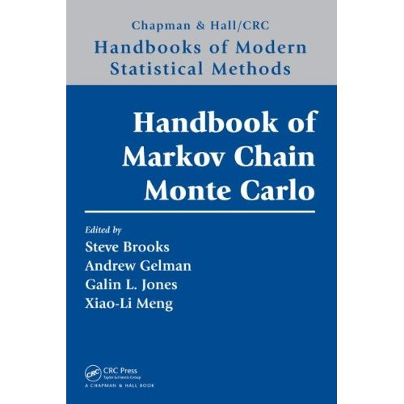
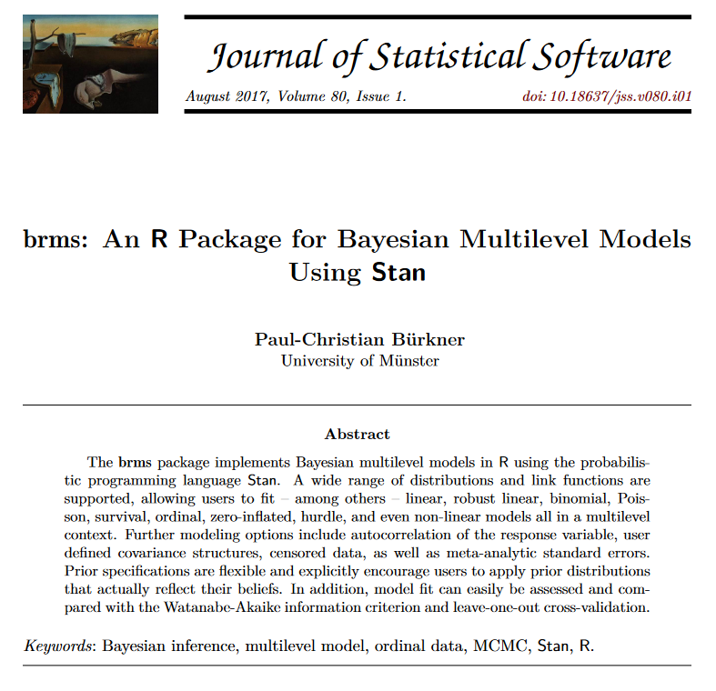

::: callout-note
## 📌 Today's Topics

We'll learn how to compute posterior distributions, step-by-step:

1. 🎯 Acceptance/Rejection Sampling (AR Sampling)
2. 🔁 Markov Chain Monte Carlo (MCMC) — more efficient than AR!

And introduce powerful R packages for Bayesian modeling:

4. 🧪 `rjags` — Gibbs sampling with BUGS syntax
5. 🔬 `rstan` — write your own Stan models
6. 📦 `brms` — beginner-friendly interface to Stan
:::

## 📦 Packages we'll use today

```{r include=TRUE, warning=FALSE, message=FALSE}
library(pacman)
p_load(dplyr, tidyr, tibble, purrr)
p_load(ggplot2)
p_load(brms)
p_load(tidybayes)
```

## 🎲 Computing Posterior Distributions

### 1️⃣ Acceptance/Rejection Sampling - Basics

Here's how AR sampling works:

1. Propose values for parameters
2. Simulate data based on those values
3. Measure how well it fits the observed data
4. Accept if close enough (✔️), reject otherwise (❌)

#### 🌽 Simulating Corn Yield vs. Plant Density

We simulate yield using a parabolic function.

Then compare simulated data to the real observed values. If the fit is good enough, we keep those parameter values.

👀 We'll visualize which parameter sets are accepted and which aren't.

```{r, echo=FALSE}
b0_true <- 5
b1_true <- 2.2
b2_true <- .125

x <- seq(0, 12, by = .2)
mu <- b0_true + x*b1_true - (x^2)*b2_true

set.seed(42)
y <- mu + rnorm(length(x), 0, sqrt(.4))

data_frame <- new_tibble(list(x = x, y = y))

# Plot
data_frame %>% 
  ggplot(data = .) +
  geom_point(aes(x = x, y = y), shape = 21, size = 2) +
  geom_smooth(aes(x = x, y = y), method = lm, formula = y ~ x + I(x^2)) +
  theme_classic()
```
Algorithm settings:
```{r settings, include=TRUE}
# Algorithm settings
K_tries <- 10^6
diff <- matrix(, K_tries, 1)
error <- 200

# Known random variables and parameters
n <- length(x)
```

```{r prep objects, include=FALSE}
posterior_samp_parameters <- matrix(, K_tries, 4)
colnames(posterior_samp_parameters) <- c("b0", "b1", "b2", "sigma")

y_hat <- matrix(, K_tries, n)
```

```{r demo acc-rej, include=FALSE}
k = 1
```

1. Generate proposal parameter values using the prior distributions.

```{r demo 1}
set.seed(6767)
b0_try <- runif(1, 4, 6)
b1_try <- runif(1, 1, 3)
b2_try <- rgamma(1, 0.1, 2)
mu_try <- b0_try + x*b1_try - (x^2)*b2_try
sigma_try <- rgamma(1, 2, 2)
```

2. Generate data with those parameters.

```{r demo 1b}
set.seed(567)
y_try <- rnorm(n, mu_try, sigma_try)
```

3. Compare the simulated data with the observed data = difference.

```{r demo 1c}
# Record difference between draw of y from prior predictive distribution and observed data
diff[k, ] <- sum(abs(y - y_try))
```

```{r demo 1d, include=FALSE}
# Save unkown random variables and parameters
y_hat[k, ] <- y_try
posterior_samp_parameters[k, ] <- c(b0_try, b1_try, b2_try, sigma_try)
```

4. Accept that combination of parameters if the difference is smaller than the predefined acceptable error. Reject it otherwise.

```{r demo 1e}
plot(x, y, xlab = "Plant density", 
     ylab = "Corn Yield (Mg/ha)", xlim = c(2, 13), ylim = c(5, 20),
     typ = "b", cex = 0.8, pch = 20, col = rgb(0.7, 0.7, 0.7, 0.9))
points(x, y_hat[k,], typ = "b", lwd = 2, 
       col = ifelse(diff[1] < error, "gold", "tomato"))
```

```{r demo 1f}
set.seed(567567)
k = 1
b0_try <- runif(1, 4, 6)
b1_try <- runif(1, 1, 3)
b2_try <- rgamma(1, 0.1, 2)
mu_try <- b0_try + x*b1_try - (x^2)*b2_try
sigma_try <- rgamma(1, 2, 2)

y_try <- rnorm(n, mu_try, sigma_try)
diff[k, ] <- sum(abs(y - y_try))
y_hat[k, ] <- y_try
posterior_samp_parameters[k, ] <- c(b0_try, b1_try, b2_try, sigma_try)

plot(x, y, xlab = "Plant density", 
     ylab = "Observed yield", xlim = c(2, 13), ylim = c(5, 20),
     typ = "b", cex = 0.8, pch = 20, col = rgb(0.7, 0.7, 0.7, 0.9))

points(x, y_hat[k,], typ = "b", lwd = 2, 
       col = ifelse(diff[1] < error, "gold", "tomato"))
```

```{r demo 1g}
set.seed(76543)
k = 1
b0_try <- runif(1, 4, 6)
b1_try <- runif(1, 1, 3)
b2_try <- rgamma(1, .5, 2)
mu_try <- b0_try + x*b1_try - (x^2)*b2_try
sigma_try <- rgamma(1, 2, 2)

y_try <- rnorm(n, mu_try, sigma_try)
diff[k, ] <- sum(abs(y - y_try))
y_hat[k, ] <- y_try
posterior_samp_parameters[k, ] <- c(b0_try, b1_try, b2_try, sigma_try)

plot(x, y, xlab = "Plant density", 
     ylab = "Observed yield", xlim = c(2, 13), ylim = c(5, 20),
     typ = "b", cex = 0.8, pch = 20, col = rgb(0.7, 0.7, 0.7, 0.9))

points(x, y_hat[k,], typ = "b", lwd = 2, 
       col = ifelse(diff[1] < error, "gold", "tomato"))
```

Now, what if we change the priors:

```{r new_priors, echo=FALSE}
k = 1
b0_try <- rnorm(1, 5, .01)
b1_try <- rnorm(1, 2.2, .01)
b2_try <- rgamma(1, .1, 2)
mu_try <- b0_try + x*b1_try - (x^2)*b2_try
sigma_try <- rgamma(1, 2, 2)

y_try <- rnorm(n, mu_try, sigma_try)
diff[k, ] <- sum(abs(y - y_try))
y_hat[k, ] <- y_try
posterior_samp_parameters[k, ] <- c(b0_try, b1_try, b2_try, sigma_try)

plot(x, y, xlab = "Plant density",
     ylab = "Observed yield", xlim = c(2, 13), ylim = c(5, 20),
     typ = "b", cex = 0.8, pch = 20, col = "grey20")

points(x, y_hat[k,], typ = "b",
       lwd = 2, 
       col = ifelse(diff[1] < error, "gold", "tomato"))
```

Now, do many tries.

```{r for_loop}
for (k in 1:K_tries) {
    
    b0_try <- runif(1, 2, 10)
    b1_try <- rnorm(1, 2.2, .5)
    b2_try <- rgamma(1, .25, 2)
    mu_try <- b0_try + x*b1_try - (x^2)*b2_try
    sigma_try <- rgamma(1, 2, 2)

    y_try <- rnorm(n, mu_try, sigma_try)
    
    diff[k, ] <- sum(abs(y - y_try))
    y_hat[k, ] <- y_try
    posterior_samp_parameters[k, ] <- c(b0_try, b1_try, b2_try, sigma_try)
}
```

Acceptance rate

```{r accept}
length(which(diff < error))/K_tries
```

Priors versus posteriors:

```{r post_b0, echo=FALSE}
filtered_b0 <- posterior_samp_parameters[which(diff < error), 1]
df_b0 <- data.frame(beta0 = filtered_b0)

ggplot(df_b0, aes(x = beta0)) +
  geom_histogram(aes(y = ..density..), fill = "#dde5b6", color = "black", bins = 30) +
  stat_function(fun = dunif, args = list(min = 2, max = 10), color = "tomato", size = 1.2) +
  xlim(1.5, 10.5) +
  labs(
    x = expression(beta[0] ~ "|" ~ y),
    y = expression("[" ~ beta[0] ~ "|" ~ y ~ "]")
  ) +
  theme_classic()
```

```{r post_b1, echo=FALSE}
filtered_b1 <- posterior_samp_parameters[which(diff < error), 2]
df_b1 <- data.frame(beta1 = filtered_b1)

ggplot(df_b1, aes(x = beta1)) +
  geom_histogram(aes(y = ..density..), fill = "#bfd8bd", color = "black", bins = 30) +
  stat_function(fun = dnorm, args = list(mean = 2.2, sd = 0.5), color = "tomato", size = 1.2) +
  xlim(2, 3) +
  labs(
    x = expression(beta[1] ~ "|" ~ y),
    y = expression("[" ~ beta[1] ~ "|" ~ y ~ "]")
  ) +
  theme_classic()
```

```{r post_b2, echo=FALSE}
filtered_values <- posterior_samp_parameters[which(diff < error), 3]
df <- data.frame(beta2 = filtered_values)

ggplot(df, aes(x = beta2)) +
  geom_histogram(aes(y = ..density..), fill = "#faf3dd", color = "black", bins = 30) +
  stat_function(fun = dgamma, args = list(shape = 0.25, rate = 2), color = "tomato", size = 1.2) +
  xlim(0, 1) +
  labs(
    x = expression(beta[2] ~ "|" ~ y),
    y = expression("[" ~ beta[2] ~ "|" ~ y ~ "]")
  ) +
  theme_classic()
```

#### 📊 Plot predictions

```{r histo}
filtered_yhat <- y_hat[which(diff < error), 50]
df_yhat <- data.frame(pred = filtered_yhat)

ggplot(df_yhat, aes(x = pred)) +
  geom_histogram(aes(y = ..density..), fill = "grey", color = "black", bins = 30) +
  geom_vline(xintercept = y[50], color = "gold", linetype = "dashed", linewidth = 1.2) +
  labs(
    x = expression(hat(y)[50]),
    y = "Density"
  ) +
  theme_classic()
```

```{r final, include=FALSE}
e.y <- colMeans(y_hat[which(diff < error), ])

lwr.CI <- apply(y_hat[which(diff < error), ], 2, FUN = quantile, prob = c(0.025))
upper.CI <- apply(y_hat[which(diff < error), ], 2, FUN = quantile, prob = c(0.975))

df_pred <- data.frame(
  x = x,
  y_obs = y,
  y_mean = e.y,
  lwr = lwr.CI,
  upr = upper.CI
)
```

```{r plot_1, echo=FALSE}
ggplot(df_pred, aes(x = x)) +
  geom_point(aes(y = y_obs), color = "grey20", size = 2) +
  geom_line(aes(y = y_obs), color = "grey20", linetype = "solid") +
  geom_line(aes(y = y_mean), color = "black", linewidth = 1.2) +
  geom_ribbon(aes(ymin = lwr, ymax = upr), fill = "grey50", alpha = 0.3) +
  labs(
    x = "Plant density",
    y = "Observed yield"
  ) +
  coord_cartesian(xlim = c(2, 13), ylim = c(5, 20)) +
  theme_classic()
```

Let's get started

## 🔁 Markov Chain Monte Carlo (MCMC)

{width="241"}

MCMC methods changed Bayesian stats forever! 🧠🔥

- They let us generate samples from **complex** distributions
- They form a **chain**, where each sample depends on the previous
- Used in packages like `brms`, `rstan`, and `rjags`

📚 More info:
- [MCMC Handbook](https://www.mcmchandbook.net/)
- [MCMCpack](https://cran.r-project.org/package=MCMCpack)
- [mcmc](https://cran.r-project.org/package=mcmc)
- [Paper: Foundations of MCMC](https://papers.ssrn.com/sol3/papers.cfm?abstract_id=3759243)

::: {align="center"}
<iframe width="840" height="473" src="https://www.youtube.com/embed/Qqz5AJjyugM" frameborder="0" allowfullscreen></iframe>
:::

## `rjags`: Just Another Gibbs Sampler

{width="318"}

🔗 Docs: <https://mcmc-jags.sourceforge.io/>  
🐛 Issues: <https://sourceforge.net/projects/mcmc-jags/>

`rjags` uses the classic **Gibbs Sampling** approach and the **BUGS** model syntax (used in WinBUGS, OpenBUGS).

- More manual than `brms`
- Ideal for users who want to write the full statistical model
- Often paired with the `coda` package for diagnostics

---

## `rstan`: Full Control with Stan

{width="190"}

🔗 Docs: <https://mc-stan.org/rstan/>  
🐛 Issues: <https://github.com/stan-dev/rstan/issues>

Stan is a **powerful**, high-performance platform for Bayesian modeling, using:
- **Hamiltonian Monte Carlo** (HMC)
- **No-U-Turn Sampler** (NUTS)

Unlike `brms`, Stan requires writing the full model, offering full flexibility and speed.

✨ `brms` can even show the Stan code it generates under the hood.

Stan also supports Python, Julia, MATLAB, and more.

---

## `brms`: Bayesian Regression Models using Stan


🔗 Docs: <https://paul-buerkner.github.io/brms/>  
🐛 Issues: <https://github.com/paul-buerkner/brms/issues>

`brms` makes it easy to run complex Bayesian models without writing Stan code manually. It is inspired by `lme4`, so syntax feels familiar.

It supports a wide range of models:
- Linear, GLM, survival, zero-inflated, ordinal, count, and more

✨ We will use `brms` as our main interface in this session.

📚 More info:
- [JSS Article on brms](https://www.jstatsoft.org/article/view/v080i01)

{width="336"}

### Fit brms

Let's now fit a Bayesian quadratic-plateau model to estimate **AONR** directly from the corn nitrogen response data.

#### Corn Data

We will again use our synthetic dataset of corn yield response to nitrogen fertilizer across two sites and three years with contrasting weather.

```{r corn_data}

# Read CSV file
cornn_data <- read.csv("data/cornn_data.csv") %>%
  mutate(
    n_trt = factor(n_trt, levels = c("N0", "N60", "N90", "N120",
                                   "N180", "N240", "N300")),
    block = factor(block),
    site = factor(site),
    year = factor(year),
    site_year = interaction(site, weather, drop = FALSE), # create interaction
    weather = factor(weather)
  ) %>%
  # IMPORTANT: blocks are nested within site (Block 1 in A is not the same as Block 1 in B)
  mutate(
    block_in_site = interaction(site, block, drop = TRUE),
    yield = yield_kgha
  )

glimpse(cornn_data)

```

### brms pars

- **WU**: Warmup iterations (burn-in). This is the number of initial samples that will be discarded to allow the Markov chain to converge to the target distribution.

- **IT**: Total iterations. This is the total number of samples to draw from the posterior distribution, including warmup.

- **TH**: Thinning interval. This is the interval at which samples are kept. For example, if TH = 5, every 5th sample will be retained, and the others will be discarded. Thinning can help reduce autocorrelation in the samples.

- **CH**: Number of chains. This is the number of independent Markov chains to run. Running multiple chains can help assess convergence and ensure that the results are not dependent on the starting values.

- **AD**: Adapt delta. This is a tuning parameter for the No-U-Turn Sampler (NUTS) algorithm used by Stan. It controls the target acceptance rate for the sampler. A higher adapt delta can lead to more accurate sampling but may increase computation time.
```{r priors}
WU <- 2000
IT <- 6000
TH <- 5
CH <- 6
AD <- 0.99
```

### Model

```{r model, message=FALSE, warning=FALSE}
bayes_model <- 
  brms::brm(
    prior = c(
      # Intercept in kg/ha
      prior('normal(6000, 2500)', nlpar = 'b0', lb = 0),
      # Initial slope in kg grain per kg N
      prior('normal(50, 25)', nlpar = 'b1', lb = 0),
      # Agronomic optimum N rate in kg N/ha
      prior('normal(180, 60)', nlpar = 'aonr', lb = 0)
    ),
    formula = bf(
      yield_kgha ~
        (1 - step(nrate_kgha - aonr)) *
          (b0 + b1 * nrate_kgha - (b1 / (2 * aonr)) * nrate_kgha^2) +
        step(nrate_kgha - aonr) *
          (b0 + b1 * aonr - (b1 / (2 * aonr)) * aonr^2),
      b0 + b1 + aonr ~ 1,
      nl = TRUE
    ),
    data = cornn_data,
    sample_prior = "yes",
    family = gaussian(link = 'identity'),
    control = list(adapt_delta = AD),
    warmup = WU, iter = IT, thin = TH,
    chains = CH, cores = CH,
    init = 0,
    seed = 1
  )

plot(bayes_model)
bayes_model
```


### Using posterior distributions

#### Prepare summary

```{r plot}
newdata <- tibble(nrate_kgha = seq(min(cornn_data$nrate_kgha), 
                                   max(cornn_data$nrate_kgha), length.out = 400))

# Expected values (population-level effects only)
m1_epred <- newdata %>%
  tidybayes::add_epred_draws(bayes_model, newdata = ., re_formula = NA, ndraws = NULL) %>%
  ungroup()

m1_epred_quantiles <- m1_epred %>%
  group_by(nrate_kgha) %>%
  summarise(
    q025 = quantile(.epred, 0.025),
    q010 = quantile(.epred, 0.10),
    q250 = quantile(.epred, 0.25),
    q500 = quantile(.epred, 0.50),
    q750 = quantile(.epred, 0.75),
    q900 = quantile(.epred, 0.90),
    q975 = quantile(.epred, 0.975),
    .groups = "drop"
  )

# Predicted values (including residual error)
m1_pred <- newdata %>%
  tidybayes::add_predicted_draws(bayes_model, newdata = ., re_formula = NA, ndraws = NULL) %>%
  ungroup()

m1_quantiles <- m1_pred %>%
  group_by(nrate_kgha) %>%
  summarise(
    q025 = quantile(.prediction, 0.025),
    q010 = quantile(.prediction, 0.10),
    q250 = quantile(.prediction, 0.25),
    q500 = quantile(.prediction, 0.50),
    q750 = quantile(.prediction, 0.75),
    q900 = quantile(.prediction, 0.90),
    q975 = quantile(.prediction, 0.975),
    .groups = "drop"
  )

# Extract posterior samples for AONR
post_pars <- bayes_model %>%
  spread_draws(b_b0_Intercept, b_b1_Intercept, b_aonr_Intercept) %>%
  mutate(AONR = b_aonr_Intercept)

# distribution of AONR
aonr_quantiles <- post_pars %>%
  summarise(
    q025 = quantile(AONR, 0.025),
    q010 = quantile(AONR, 0.10),
    q250 = quantile(AONR, 0.25),
    q500 = quantile(AONR, 0.50),
    q750 = quantile(AONR, 0.75),
    q900 = quantile(AONR, 0.90),
    q975 = quantile(AONR, 0.975)
  )
```

#### Plot posterior

```{r plot_posterior}
m1_plot <- ggplot() +
  geom_ribbon(data = m1_quantiles, alpha = 0.60, fill = "cornsilk1",
              aes(x = nrate_kgha, ymin = q025, ymax = q975)) +
  geom_ribbon(data = m1_quantiles, alpha = 0.25, fill = "cornsilk3",
              aes(x = nrate_kgha, ymin = q010, ymax = q900)) +
  geom_ribbon(data = m1_quantiles, alpha = 0.5, fill = "gold3",
              aes(x = nrate_kgha, ymin = q250, ymax = q750)) +
  geom_path(data = m1_epred_quantiles,
            aes(x = nrate_kgha, y = q500, color = "brms()"), linewidth = 1) +
  geom_point(data = cornn_data, aes(x = nrate_kgha, y = yield_kgha, color = "brms()"), alpha = 0.25) +
  scale_color_manual(values = c("purple4", "tomato")) +
  theme_classic() +
  theme(
    legend.position = 'right',
    legend.title = element_blank(),
    panel.grid = element_blank(),
    axis.title = element_text(size = rel(1.3)),
    axis.text = element_text(size = rel(1)),
    strip.text = element_text(size = rel(1.1))
  ) +
  labs(x = "N fertilizer rate (kg/ha)", y = "Corn yield (kg/ha)")

m1_plot
```

#### Posterior distribution of AONR

```{r aonr_post}
post_pars %>%
  ggplot(aes(x = AONR)) +
  geom_histogram(bins = 40, fill = "grey70", color = "black") +
  theme_classic() +
  labs(x = "Posterior AONR (kg N/ha)", y = "Frequency")+
  # add ribbons for quantiles
  geom_vline(xintercept = aonr_quantiles$q025, 
             color = "grey15", linetype = "dashed", size = 1.2)+
  geom_vline(xintercept = aonr_quantiles$q975, 
             color = "grey15", linetype = "dashed", size = 1.2)+
  geom_vline(xintercept = aonr_quantiles$q500, 
             color = "tomato", linetype = "solid", size = 1.2)

```

## Group-specific quadratic-plateau model with `site_year`

Now let's extend the global model. Here, we will:

- include a random block effect nested within `site_year`
- allow the quadratic-plateau parameters to vary by `site_year`
- sample posterior fitted values for each `site_year`
- plot fitted curves and predictive intervals by environment

### Priors for `site_year`-specific parameters


```{r priors_site_year}
priors_site_year <- c(
  prior("normal(6000, 2500)", nlpar = "b0", lb = 0),
  prior("normal(50, 25)", nlpar = "b1", lb = 0),
  prior("normal(180, 60)", nlpar = "aonr", lb = 0),
  prior("student_t(3, 0, 1000)", class = "sd", nlpar = "u", group = "site_year:block"),
  prior("student_t(3, 0, 1000)", class = "sigma", lb = 0)
)
```

### Model with `site_year`-specific parameters

```{r model_site_year, message=FALSE, warning=FALSE}
bayes_model_sy <- 
  brms::brm(
    prior = priors_site_year,
    formula = bf(
      yield_kgha ~
        (1 - step(nrate_kgha - aonr)) *
          (b0 + b1 * nrate_kgha - (b1 / (2 * aonr)) * nrate_kgha^2) +
        step(nrate_kgha - aonr) *
          (b0 + b1 * aonr - (b1 / (2 * aonr)) * aonr^2) +
        u,
      b0 ~ 0 + site_year,
      b1 ~ 0 + site_year,
      aonr ~ 0 + site_year,
      u ~ 0 + (1 | site_year:block),
      nl = TRUE
    ),
    data = cornn_data,
    family = gaussian(),
    sample_prior = "yes",
    control = list(adapt_delta = 0.995, max_treedepth = 15),
    warmup = WU, iter = IT, thin = TH,
    chains = CH, cores = CH,
    seed = 1
  )

plot(bayes_model_sy)
summary(bayes_model_sy)
```

### Prepare summaries by `site_year`

```{r draws_site_year}
newdata_sy <- cornn_data %>%
  distinct(site_year) %>%
  tidyr::crossing(
    nrate_kgha = seq(min(cornn_data$nrate_kgha), max(cornn_data$nrate_kgha), length.out = 300)
  )

# Expected values (site_year-specific fixed effects only)
fit_sy_epred <- newdata_sy %>%
  tidybayes::add_epred_draws(
    bayes_model_sy,
    newdata = .,
    re_formula = NA,
    ndraws = NULL
  ) %>%
  ungroup()

fit_sy_epred_quantiles <- fit_sy_epred %>%
  group_by(site_year, nrate_kgha) %>%
  summarise(
    q025 = quantile(.epred, 0.025),
    q010 = quantile(.epred, 0.10),
    q250 = quantile(.epred, 0.25),
    q500 = quantile(.epred, 0.50),
    q750 = quantile(.epred, 0.75),
    q900 = quantile(.epred, 0.90),
    q975 = quantile(.epred, 0.975),
    .groups = "drop"
  )

# Predicted values (including residual error)
fit_sy_pred <- newdata_sy %>%
  tidybayes::add_predicted_draws(
    bayes_model_sy,
    newdata = .,
    re_formula = NA,
    ndraws = NULL
  ) %>%
  ungroup()

fit_sy_quantiles <- fit_sy_pred %>%
  group_by(site_year, nrate_kgha) %>%
  summarise(
    q025 = quantile(.prediction, 0.025),
    q010 = quantile(.prediction, 0.10),
    q250 = quantile(.prediction, 0.25),
    q500 = quantile(.prediction, 0.50),
    q750 = quantile(.prediction, 0.75),
    q900 = quantile(.prediction, 0.90),
    q975 = quantile(.prediction, 0.975),
    .groups = "drop"
  )

# Extract posterior samples for AONR by site_year
post_pars_sy <- bayes_model_sy %>%
  posterior::as_draws_df() %>%
  as_tibble() %>%
  select(starts_with("b_aonr_site_year")) %>%
  pivot_longer(
    cols = everything(),
    names_to = "site_year",
    values_to = "AONR"
  ) %>%
  mutate(site_year = sub("^b_aonr_site_year", "", site_year))

# Distribution of AONR by site_year
AONR_quantiles_sy <- post_pars_sy %>%
  group_by(site_year) %>%
  summarise(
    q025 = quantile(AONR, 0.025),
    q010 = quantile(AONR, 0.10),
    q250 = quantile(AONR, 0.25),
    q500 = quantile(AONR, 0.50),
    q750 = quantile(AONR, 0.75),
    q900 = quantile(AONR, 0.90),
    q975 = quantile(AONR, 0.975),
    .groups = "drop"
  )
```

### Plot fitted curves and intervals by `site_year`

```{r plot_site_year}
weather_cols <- c(
  dry = "#b2182b",
  normal = "#1b9e77",
  wet = "#2c7fb8"
)

ggplot() +
  geom_ribbon(
    data = fit_sy_quantiles,
    aes(x = nrate_kgha, ymin = q025, ymax = q975),
    fill = "grey70", alpha = 0.30
  ) +
  geom_ribbon(
    data = fit_sy_quantiles,
    aes(x = nrate_kgha, ymin = q250, ymax = q750),
    fill = "grey45", alpha = 0.45
  ) +
  geom_line(
    data = fit_sy_epred_quantiles,
    aes(x = nrate_kgha, y = q500),
    linewidth = 1
  ) +
  geom_point(
    data = cornn_data,
    aes(x = nrate_kgha, y = yield_kgha, color = weather, shape = site),
    alpha = 0.70, size = 2
  ) +
  scale_color_manual(values = weather_cols, name = "Weather") +
  scale_shape_manual(values = c(16, 17, 15, 18, 8), name = "Site") +
  facet_wrap(~ site_year) +
  theme_classic() +
  labs(
    x = "N fertilizer rate (kg/ha)",
    y = "Corn yield (kg/ha)",
    title = "Quadratic-plateau response by site_year"
  )
```

### Plot AONR quantile bands by `site_year`

```{r plot_site_year_aonr}
aonr_rects <- AONR_quantiles_sy %>%
  left_join(
    cornn_data %>%
      group_by(site_year) %>%
      summarise(
        ymin = min(yield_kgha, na.rm = TRUE),
        ymax = max(yield_kgha, na.rm = TRUE),
        .groups = "drop"
      ),
    by = "site_year"
  )

weather_cols <- c(
  dry = "#b2182b",
  normal = "#1b9e77",
  wet = "#2c7fb8"
)

# Plot with AONR quantile bands 
ggplot() +
  geom_rect(
    data = aonr_rects,
    aes(xmin = q025, xmax = q975, ymin = 0, ymax = 17500),
    fill = "grey70", alpha = 0.18,
    inherit.aes = FALSE
  ) +
  geom_rect(
    data = aonr_rects,
    aes(xmin = q250, xmax = q750, ymin = 0, ymax = 17500),
    fill = "grey45", alpha = 0.28,
    inherit.aes = FALSE
  ) +
  geom_line(
    data = fit_sy_epred_quantiles,
    aes(x = nrate_kgha, y = q500),
    linewidth = 1
  ) +
  geom_vline(
    data = AONR_quantiles_sy,
    aes(xintercept = q500),
    linetype = 2,
    linewidth = 0.8,
    inherit.aes = FALSE
  ) +
  geom_point(
    data = cornn_data,
    aes(x = nrate_kgha, y = yield_kgha, color = weather, shape = site),
    alpha = 0.70, size = 2
  ) +
  scale_color_manual(values = weather_cols, name = "Weather") +
  scale_shape_manual(values = c(16, 17, 15, 18, 8), name = "Site") +
  facet_wrap(~ site_year) +
  theme_classic() +
  labs(
    x = "N fertilizer rate (kg/ha)",
    y = "Corn yield (kg/ha)",
    title = "Quadratic-plateau response by site_year with AONR bands"
  )
```

## Final considerations

Bayesian analysis does not change the agronomic question. We still want to understand crop response, estimate meaningful parameters, and quantify uncertainty. What changes is the way uncertainty is represented and updated. Instead of focusing only on point estimates and p-values, Bayesian models allow us to work directly with probability distributions for parameters such as yield response, plateau, and AONR.

In this tutorial, we moved from a simple acceptance-rejection sampler to modern Bayesian regression with `brms`. That progression is important. The early examples help us understand the logic of posterior updating, while the `brms` models show how these ideas scale to realistic agronomic datasets.

A few practical lessons from this class:

- Priors should be chosen on the scale of the data and with agronomic meaning in mind.
- Posterior expected values (`epred`) and posterior predictive values (`prediction`) answer different questions, so both can be useful.
- Reparameterizing the model in terms of AONR can be more intuitive than working directly with curvature coefficients.
- Group-specific models can reveal that response curves and optimum N rates differ substantially across environments.
- Adding block effects helps respect the experimental design and can improve inference.

## Suggested practice 

You can extend these examples by:

- comparing weakly informative versus strongly informative priors
- checking model diagnostics such as trace plots, effective sample size, and R-hat
- comparing Bayesian quadratic and quadratic-plateau models
- evaluating whether AONR differs among environments
- incorporating additional hierarchical structure, such as years, sites, or weather classes

## Closing message

Bayesian methods provide a flexible framework to connect prior knowledge, experimental data, and uncertainty in a way that is highly relevant for agricultural research. They are powerful models, but they still require the same discipline as any other statistical analysis: understanding the experiment, checking diagnostics, and asking whether the results make biological and agronomic sense.


