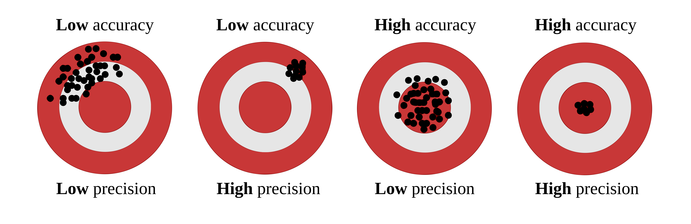

# What is cross-validation?

When we talk about predictive agriculture, it is very important to understand that many models are built mainly for **explanation**, not necessarily for **prediction of new cases**. A common mistake is to evaluate model performance with the same data used to fit the model. That usually leads to an overly optimistic impression of how well the model will work with future observations.

In my view, the fitting algorithm matters, but what matters even more is whether model performance is evaluated with **independent data** that were not used for model training. That is the core idea behind **out-of-sample evaluation**. Cross-validation is one of the most useful tools for doing this because it helps us estimate how well a model may generalize to new data @james2013 @hastie2009.

::: callout-note
## 🔎 Main idea

A model can look excellent on the data used to fit it and still perform poorly on new observations.
:::

```{mermaid}
flowchart LR
    A[📦 Full dataset] --> B[🛠️ Training set]
    A --> C[🧪 Test set]
    B --> D[📈 Fit model]
    D --> E[🔮 Predict unseen data]
    C --> F[📏 Compare observed vs predicted]
    E --> F

    style A fill:#E8F1FB,stroke:#4C78A8,stroke-width:2px,color:#111
    style B fill:#EAF7EA,stroke:#59A14F,stroke-width:2px,color:#111
    style C fill:#FCECCF,stroke:#F28E2B,stroke-width:2px,color:#111
    style D fill:#F3E8F8,stroke:#B07AA1,stroke-width:2px,color:#111
    style E fill:#EAF7EA,stroke:#59A14F,stroke-width:2px,color:#111
    style F fill:#FDEBEC,stroke:#E15759,stroke-width:2px,color:#111
```

# Important vocabulary

## What is a model?

A model is a mathematical representation of a system or process that we use to understand, explain, or predict outcomes. In agriculture, a model could represent the relationship between soil properties and crop yield, a calibration between two laboratory methods, or an algorithm that predicts disease risk.

## What is training a model?

Training a model means using a dataset to estimate its parameters. In regression, that usually means estimating coefficients that best describe the relationship between predictors and response variables.

## What is testing a model?

Testing a model means evaluating its performance on data that were not used during training. This helps us assess how well the model generalizes to new observations. Common performance metrics include Root Mean Squared Error (RMSE), Mean Absolute Error (MAE), and the coefficient of determination ($R^2$).

Be careful, though. A metric is only useful if it matches the question being asked. For example, RMSE and MAE are usually easier to interpret as prediction-error metrics, while $R^2$ can be less informative for nonlinear models or for situations where the main goal is calibration rather than explanation.

## Testing vs validation

These terms are often used loosely, but it helps to separate them.

- **Testing** usually refers to evaluating the model on a holdout dataset.
- **Validation** usually refers to repeatedly evaluating the model across multiple splits of the data, as in cross-validation.

Validation gives a more stable estimate of out-of-sample performance because results are not tied to a single arbitrary split @james2013 @kuhn2013.

## What are hyper-parameters?

Hyper-parameters are settings chosen by the analyst **before** the model is trained. They are not estimated directly from the data in the same way as model coefficients. Instead, they control how flexible the model can be or how the fitting process behaves.

A few examples:

- In **K-Fold cross-validation**, the value of $k$ is a hyper-parameter.
- In a **random forest**, the number of trees and the number of variables tried at each split are hyper-parameters.
- In **k-nearest neighbors**, the number of neighbors is a hyper-parameter.

For example, imagine fitting a k-nearest neighbors model to predict yield. If we choose $k = 1$, the model may follow the training data too closely and overfit. If we choose a much larger value of $k$, the model may become too smooth and miss important structure. Cross-validation is often used to compare candidate hyper-parameter values and choose a setting that performs well on independent data.

In contrast, in a simple linear regression, the intercept and slope are **parameters**, because they are estimated from the data during model fitting.

## Precision vs accuracy

These two terms are often used as if they meant the same thing, but they describe different properties of model performance.

- **Accuracy** refers to how close predictions are, on average, to the observed values.
- **Precision** refers to how tightly predictions follow a consistent pattern, regardless of whether that pattern is centered on the true values.

🎯 Think of **accuracy** as being close to the target.
📌 Think of **precision** as hitting nearly the same place repeatedly.

A model may be precise but not accurate. For example, imagine a model that consistently predicts values about 15 units above the observed ones. The predictions may align very tightly along a straight line, which suggests high precision, but they are still systematically biased, which means low accuracy. On the other hand, a model may be approximately accurate on average but quite scattered, meaning low precision.

This distinction is especially important when evaluating predicted vs observed datasets. Correndo et al. (2021) discuss how prediction error can be interpreted geometrically as a combination of lack of accuracy and lack of precision @correndo2021. In practical terms, that means we should not rely on a single summary metric alone. Two models can have similar RMSE values while differing in whether their main problem is systematic bias or random scatter.

In predictive agronomy, both matter. A useful model should ideally be close to the truth **and** consistent enough to support decisions.

::: callout-tip
## 🎯 Quick intuition

Accuracy is about **location relative to the truth**. Precision is about **spread among repeated predictions**.
:::

### Visual examples

The classic target diagram is a useful first illustration. The center of the target represents the truth. Predictions close to the center are more accurate, whereas predictions clustered tightly together are more precise.

{fig-alt="Target diagram illustrating combinations of low/high accuracy and low/high precision" fig-align="center" width="90%"}

Correndo et al. (2021) also show how these concepts appear in predicted-versus-observed datasets. In that context, **accuracy** is related to how close predictions are to the 1:1 line, whereas **precision** is related to how tightly the cloud of points follows a consistent relationship around that line or fitted trend @correndo2021.

{fig-alt="Predicted versus observed examples showing different combinations of agreement, accuracy, and precision" fig-align="center" width="95%"}

A useful bridge between both figures is this:

- 🎯 **Accuracy** asks whether predictions are centered near the truth.
- 📌 **Precision** asks whether predictions are tightly grouped.
- 📉 A model can fail mainly because of **systematic bias** (accuracy problem), **scatter** (precision problem), or both.
:::

## Bias-variance trade-off

The bias-variance trade-off is a fundamental concept in predictive modeling. It helps explain **why a model can miss the truth in two different ways**.

- **Bias** refers to systematic deviation from the truth. In practical terms, a high-bias model tends to be consistently off target.
- **Variance** refers to instability across samples or training sets. A high-variance model is overly sensitive to the particular data used for fitting and may produce predictions that change too much from one sample to another.

This connects naturally with the ideas of **accuracy** and **precision**, but the terms are not exactly interchangeable.

- **Bias is closely related to accuracy**: if bias is large, predictions tend to be less accurate because they are systematically shifted away from the truth.
- **Variance is closely related to precision**: if variance is large, predictions tend to be less precise because they are more scattered and less stable.

So, as a first approximation:

- 🎯 **Accuracy** is mainly threatened by **bias**.
- 📌 **Precision** is mainly threatened by **variance**.

Still, it is worth being careful. Bias and variance are properties of a modeling process across repeated samples, whereas accuracy and precision are often used to describe the pattern seen in a specific predicted-versus-observed dataset. The ideas are strongly connected, but they are not strictly identical.

A model with high bias may underfit the data because it is too rigid to capture the main structure. A model with high variance may overfit because it is too sensitive to noise in the training data. Cross-validation helps us detect that trade-off by estimating how well the model performs on independent data @hastie2009 @james2013.

::: callout-important
## ⚖️ Bias, variance, accuracy, and precision

- High bias often means **lower accuracy**.
- High variance often means **lower precision**.
- Good predictive models aim for both **low bias** and **low variance**.
:::

## What is overfitting?

Overfitting occurs when a model learns idiosyncrasies of the training dataset rather than the broader pattern that we care about. As a result, the model may look strong during training but weak when applied to new observations. Cross-validation helps us detect that problem earlier by forcing the model to predict data it has not seen before @hastie2009 @james2013.

Cross-validation is a statistical strategy in which the data are split into subsets, the model is trained on one portion, and evaluated on another. This process is repeated multiple times to reduce dependence on a single split. Common approaches include Leave-One-Out Cross-Validation (LOOCV), K-Fold Cross-Validation, and Leave-One-Group-Out Cross-Validation (LOGO-CV).

Let us now implement these methods in R using a simulated dataset of soil test measurements.

# Packages

```{r}
# Load required packages
library(pacman)
p_load(dplyr, tidyr, purrr, tibble)  # data manipulation and iteration
p_load(ggplot2)                      # plotting
p_load(caret)                        # creating folds for K-Fold CV
p_load(metrica)                      # performance metrics and plotting
```

# Data

Let us use a dataset that simulates soil test measurements at different depths (0-10 cm and 0-20 cm) with a group variable to demonstrate LOGO-CV. The dataset will have 100 observations and 10 groups. The relationship between the two soil test measurements will vary across groups to mimic realistic between-group heterogeneity.

```{r}
set.seed(123)

data <- tibble(
  d10 = runif(100, 5, 100),
  group = factor(rep(1:10, each = 10)),
  d20 = case_when(
    group == "1"  ~ 2  + d10 * 1.20 + rnorm(10, 0, 6),
    group == "2"  ~ -2 + d10 * 1.30 + rnorm(10, 0, 10),
    group == "3"  ~ 3  + d10 * 1.10 + rnorm(10, 0, 8),
    group == "4"  ~ 4  + d10 * 1.50 + rnorm(10, 0, 6),
    group == "5"  ~ -4 + d10 * 1.25 + rnorm(10, 0, 3),
    group == "6"  ~ 10 + d10 * 1.35 + rnorm(10, 0, 8),
    group == "7"  ~ -8 + d10 * 1.15 + rnorm(10, 0, 7),
    group == "8"  ~ 2  + d10 * 1.45 + rnorm(10, 0, 9),
    group == "9"  ~ d10 * 1.30 + rnorm(10, 0, 11),
    group == "10" ~ d10 * 1.40 + rnorm(10, 0, 9)
  )
)
```

# Exploratory data analysis

First, let us inspect the relationship between the two soil test measurements and how it varies across groups.

```{r}
plot <- 
  ggplot(data, aes(x = d10, y = d20)) +
  geom_point(aes(color = group), alpha = 0.8) +
  geom_smooth(method = "lm", formula = y ~ x, se = FALSE,
              color = "black", linewidth = 1.2) +
  geom_abline(slope = 1, intercept = 0,
              linetype = "dashed", color = "black") +
  scale_x_continuous(limits = c(0, 150)) +
  scale_y_continuous(limits = c(0, 150)) +
  theme_classic() +
  labs(
    x = "Soil test at 0-10 cm (d10)",
    y = "Soil test at 0-20 cm (d20)",
    color = "Group"
  )

plot

plot +
  geom_smooth(method = "lm", formula = y ~ x, se = FALSE,
              aes(color = group), linewidth = 0.8) +
  geom_smooth(method = "lm", formula = y ~ x, se = FALSE,
              color = "black", linewidth = 1.2)

```

## Training Predicted vs. Observed
Before we dive into cross-validation, let us fit a simple linear regression model to the entire dataset and visualize the predicted vs observed values.
```{r}
lm_model <- lm(d20 ~ d10, data = data)

train_po <- data %>%
  mutate(predicted_020 = predict(lm_model))

metrica::scatter_plot(data = train_po, 
                      obs = d20, 
                      pred = predicted_020,
                      print_metrics = TRUE,
                      metrics_list = c("RMSE", "MAE", "R2")) +
  geom_point(aes(color = group), alpha = 0.8)
```

::: callout-tip
## 🌱 Why this matters

If observations from the same site, year, farm, field, or depth interval are related to each other, a random split may make model performance look better than it really is. In those situations, grouped resampling methods such as LOGO-CV are often more appropriate @roberts2017.
:::

# 1. Leave-One-Out Cross-Validation (LOOCV)

::: callout-note
## 👤 LOOCV in one sentence

Train with all observations except one, predict that one, and repeat for every observation.
:::


LOOCV leaves out one observation at a time, fits the model with all remaining observations, and predicts the left-out observation. This is repeated for every observation in the dataset.

LOOCV has two main features:

- It uses nearly all available data for training in each iteration.
- It can be computationally expensive because the model is refit once per observation.

LOOCV often gives a low-bias estimate of prediction error, but it may still be inappropriate when observations are not independent, such as repeated measurements from the same site or year @hastie2009 @roberts2017.

## Function

```{r}
loocv_lm <- function(data) {
  results <- purrr::map_dfr(seq_len(nrow(data)), function(i) {
    train_data <- data[-i, ]
    test_data  <- data[i, ]
    
    lm_model <- lm(d20 ~ d10, data = train_data)
    slope <- coef(lm_model)[2]
    intercept <- coef(lm_model)[1]
    predicted <- intercept + slope * test_data$d10
    
    tibble(
      observed = test_data$d20,
      predicted = predicted
    )
  })
  
  results
}
```

## Run LOOCV

```{r}
loocv_results <- loocv_lm(data)
```

## Performance metrics for LOOCV

```{r}
loocv_metrics <- loocv_results %>%
  summarize(
    RMSE = metrica::RMSE(obs = observed, pred = predicted),
    MAE  = metrica::MAE(obs = observed, pred = predicted),
    R2   = metrica::R2(obs = observed, pred = predicted)
  ) %>% 
  as.data.frame()

loocv_metrics
```

## Visualize LOOCV predictions

```{r}
metrica::scatter_plot(data = loocv_results, obs = observed, pred = predicted,
                      print_metrics = TRUE,
                      metrics_list = c("RMSE", "MAE", "R2") ) 
```

---

# 2. K-Fold Cross-Validation

::: callout-note
## 🧩 K-Fold in one sentence

Split the data into $k$ parts, leave one part out for testing, and repeat until every part has been tested once.
:::


K-Fold CV partitions the dataset into $k$ folds. The model is fitted using $k-1$ folds and tested on the remaining fold. This process is repeated until every fold has served once as the test set.

Compared with LOOCV, K-Fold CV is often more computationally efficient and can produce a more stable estimate of prediction error. In practice, values such as $k = 5$ or $k = 10$ are common choices @james2013 @kuhn2013.

Still, ordinary K-Fold CV does **not** guarantee independence between training and testing sets when observations are clustered by site, year, farm, or experiment. That is exactly where grouped resampling becomes important.

## Function

```{r}
kfold_lm <- function(data, k = 10) {
  folds <- caret::createFolds(data$d10, k = k, list = TRUE)
  
  results <- purrr::map_dfr(seq_len(k), function(i) {
    train_data <- data[-folds[[i]], ]
    test_data  <- data[folds[[i]], ]
    
    lm_model <- lm(d20 ~ d10, data = train_data)
    slope <- coef(lm_model)[2]
    intercept <- coef(lm_model)[1]
    predictions <- intercept + slope * test_data$d10
    
    tibble(
      fold = as.character(i),
      observed = test_data$d20,
      predicted = predictions
    )
  })
  
  results
}
```

## Run K-Fold CV

```{r}
kfold_results <- kfold_lm(data, k = 10)
```

## Performance metrics for K-Fold

```{r}
kfold_metrics <- kfold_results %>%
  group_by(fold) %>% 
  summarise(
    RMSE = metrica::RMSE(obs = observed, pred = predicted),
    MAE  = metrica::MAE(obs = observed, pred = predicted),
    R2   = metrica::R2(obs = observed, pred = predicted)
  ) %>% 
  as.data.frame()

kfold_metrics
```

## Plot metrics

```{r}
kfold_metrics %>% 
  pivot_longer(cols = c(RMSE, MAE, R2),
               names_to = "metric", values_to = "score") %>% 
  mutate(score = as.numeric(score)) %>% 
  ggplot(aes(x = metric, y = score, fill = metric)) +
  geom_boxplot() +
  geom_jitter(aes(color = fold), width = 0.12) +
  facet_wrap(~metric, scales = "free_y") +
  theme_classic() +
  theme(legend.position = "right",
        axis.title.x = element_blank())
```

## Visualize K-Fold predictions

```{r}
metrica::scatter_plot(data = kfold_results, obs = observed, pred = predicted,
                      print_metrics = TRUE,
                      metrics_list = c("RMSE", "MAE", "R2")) +
  geom_point(aes(color = fold)) +
  theme(legend.position = "right") #+
  #facet_wrap(~fold)
```

---

# 3. Leave-One-Group-Out Cross-Validation (LOGO-CV)

::: callout-note
## 🏡 LOGO-CV in one sentence

Leave out one entire group, such as a site or year, test on that group, and repeat for all groups.
:::


LOGO-CV is especially useful when observations belong to groups such as sites, years, farms, blocks, or experiments. Instead of leaving out one observation, LOGO-CV leaves out one **entire group** at a time. The model is trained on the remaining groups and tested on the held-out group.

This is often a much more realistic assessment of predictive performance when data have hierarchical, temporal, or spatial structure @roberts2017.

## Function

```{r}
logocv_lm <- function(data) {
  unique_groups <- unique(data$group)
  
  results <- purrr::map_dfr(unique_groups, function(g) {
    train_data <- dplyr::filter(data, group != g)
    test_data  <- dplyr::filter(data, group == g)
    
    lm_model <- lm(d20 ~ d10, data = train_data)
    slope <- coef(lm_model)[2]
    intercept <- coef(lm_model)[1]
    predictions <- intercept + slope * test_data$d10
    
    tibble(
      group = as.character(g),
      observed = test_data$d20,
      predicted = predictions
    )
  })
  
  results
}
```

## Run LOGO-CV

```{r}
logocv_results <- logocv_lm(data)
```

## Performance metrics for LOGO-CV

```{r}
logocv_metrics <- logocv_results %>%
  group_by(group) %>% 
  summarise(
    RMSE = metrica::RMSE(obs = observed, pred = predicted),
    MAE  = metrica::MAE(obs = observed, pred = predicted),
    R2   = metrica::R2(obs = observed, pred = predicted)
  ) %>% 
  as.data.frame()

logocv_metrics
```

## Plot metrics

```{r}
logocv_metrics %>% 
  pivot_longer(cols = c(RMSE, MAE, R2),
               names_to = "metric", values_to = "score") %>% 
  mutate(score = as.numeric(score)) %>% 
  ggplot(aes(x = metric, y = score, fill = metric)) +
  geom_boxplot() +
  geom_jitter(aes(color = group), width = 0.12) +
  facet_wrap(~metric, scales = "free_y") +
  theme_classic() +
  theme(legend.position = "right",
        axis.title.x = element_blank())
```

## Visualize LOGO-CV predictions

```{r}
metrica::scatter_plot(data = logocv_results, obs = observed, pred = predicted,
                      print_metrics = TRUE,
                      metrics_list = c("RMSE", "MAE", "R2")) +
  geom_point(aes(color = group)) +
  theme(legend.position = "right") #+
  #facet_wrap(~group)

# Plot predicted vs observed facetting by group
logocv_results %>% 
  ggplot(aes(x = observed, y = predicted)) +
  geom_point(aes(color = group), alpha = 0.8) +
  geom_smooth(method = "lm", formula = y ~ x, se = FALSE,
              color = "black", linewidth = 1.2) +
  geom_abline(slope = 1, intercept = 0,
              linetype = "dashed", color = "black") +
  facet_wrap(~group) +
  theme_classic() +
  labs(
    x = "Observed d20",
    y = "Predicted d20",
    color = "Group"
  ) +
  theme(legend.position = "right")
```

# Comparing resampling strategies

::: callout-important
## 🧠 Key question

What exactly is the model supposed to predict: a new point from the same dataset, or a truly new site, year, farm, or experiment?
:::


A useful practical question is not only **how** to run cross-validation, but also **which resampling unit is scientifically defensible**.

- If observations are independent, LOOCV or K-Fold CV may be reasonable.
- If observations are clustered by site, farm, year, or experiment, LOGO-CV is often more honest.
- The more similar the training and test data are, the more optimistic the estimated performance may become.

In agronomy, this point is critical. Predicting a new soil sample from the same field is not the same problem as predicting a new field, or a new year, or a new region.

# About nested cross-validation

Nested cross-validation is useful when there is an **inner loop for model selection or hyperparameter tuning** and an **outer loop for final performance evaluation** @hastie2009 @james2013. That framework is very helpful for models such as random forests, support vector machines, penalized regression, or k-nearest neighbors, where hyper-parameters must be selected without leaking information from the test set.

For the simple linear regression example shown here, however, there is no real hyper-parameter tuning step. Because of that, nested CV is included here only to show the general idea of how a nested resampling workflow operates.

::: callout-warning
## ⚠️ Important caveat

Nested CV is most useful when the inner loop is used to choose model settings. If a model has no meaningful tuning step, ordinary LOOCV, K-Fold CV, or LOGO-CV are usually enough.
:::

## Skeleton of nested CV logic

```{mermaid}
flowchart TD
    A[🧭 Outer split] --> B[🌾 Outer-training groups]
    A --> C[🚫 Outer test group held out]
    B --> D[🔁 Inner CV on outer-training groups only]
    D --> E[🛠️ Fit candidate models across inner folds]
    E --> F[📏 Inner predicted vs observed]
    F --> G[✅ Choose best hyper-parameter setting]
    G --> H[📈 Refit final model on all outer-training groups]
    H --> I[🔮 Predict outer test group]
    C --> J[📋 Outer observed values]
    I --> K[🧪 Outer predicted vs observed]
    J --> K

    style A fill:#E8F1FB,stroke:#4C78A8,stroke-width:2px,color:#111
    style B fill:#EAF7EA,stroke:#59A14F,stroke-width:2px,color:#111
    style C fill:#FDEBEC,stroke:#E15759,stroke-width:2px,color:#111
    style D fill:#FCECCF,stroke:#F28E2B,stroke-width:2px,color:#111
    style E fill:#F3E8F8,stroke:#B07AA1,stroke-width:2px,color:#111
    style F fill:#E8F1FB,stroke:#4C78A8,stroke-width:2px,color:#111
    style G fill:#EAF7EA,stroke:#59A14F,stroke-width:2px,color:#111
    style H fill:#F3E8F8,stroke:#B07AA1,stroke-width:2px,color:#111
    style I fill:#EAF7EA,stroke:#59A14F,stroke-width:2px,color:#111
    style J fill:#FCECCF,stroke:#F28E2B,stroke-width:2px,color:#111
    style K fill:#FDEBEC,stroke:#E15759,stroke-width:2px,color:#111
```


# Final comments

Cross-validation is a core tool for evaluating predictive performance. The main lesson is not merely how to split the data, but whether the split reflects the real prediction problem.

For this example:

- **LOOCV** is easy to explain and uses almost all observations for training.
- **K-Fold CV** is often a practical default.
- **LOGO-CV** is usually more appropriate when data are grouped.
- **Nested CV** becomes especially useful when hyper-parameters must be tuned inside the workflow.

In other words, the best cross-validation strategy is the one that best mimics the conditions under which the model will actually be used.

# References

::: {#refs}
:::
